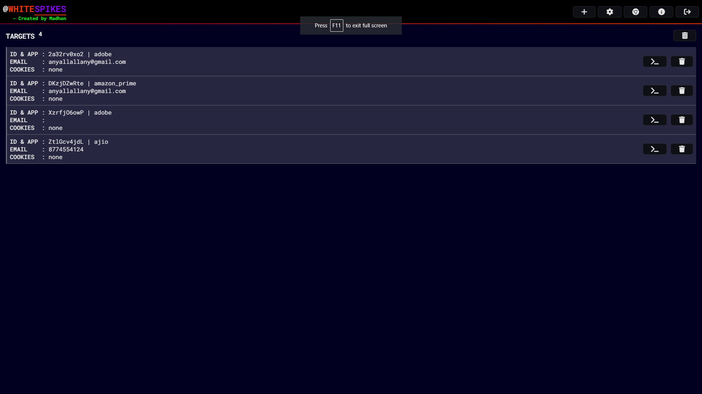
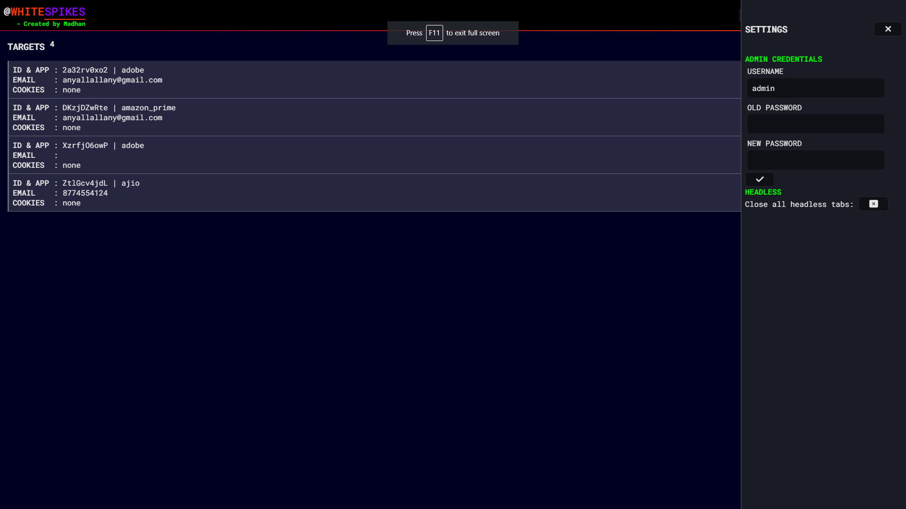
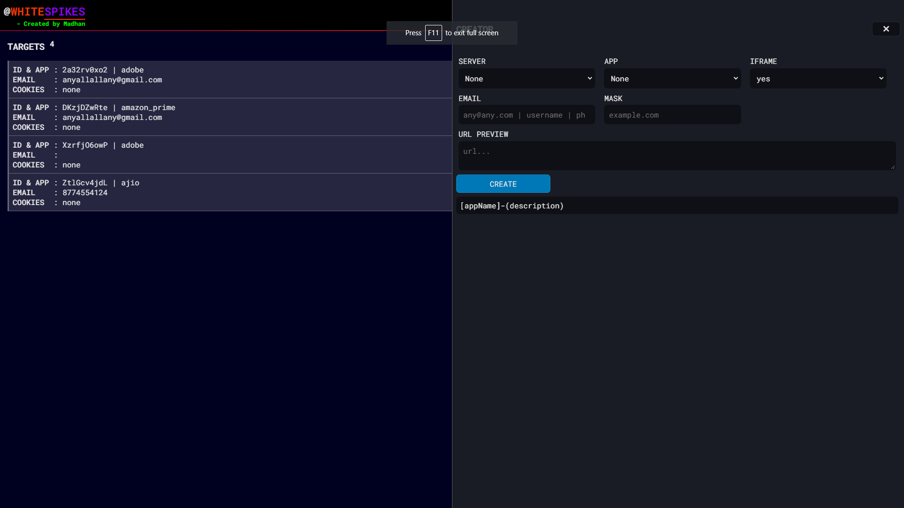
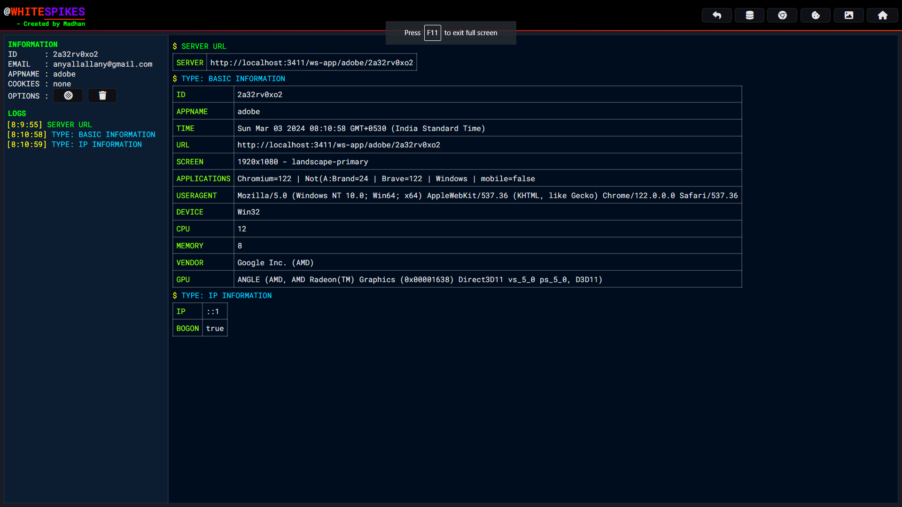

# WHITE SPIKES - 2.0.0

- The Best Automatic Social Media Phishing Tool. Recall that this is solely for awareness-raising or educational purposes only. Through the use of this tool, we are able to gather and store data such as usernames, passwords, emails, OTPs, TWO-FACTOR-AUTHENDICATION BYPASSES, RESEND OTPs, etc. And store in our database for later use.

    1. Username (email, password, mobile number, username) Bypass 
    2. Passwords Bypass 
    3. 2FA (otp codes, authenticator app codes, Qr scanning) Bypass 
    4. Resend otp code Bypass 
    5. Select auth device Bypass 

### Disclaimer
```
Title: white-spikes
Copyright (c) 2024 Madhanmaaz

All rights owned by Madhanmaaz.

The "white-spikes" tool is an educational resource designed for awareness-raising and ethical purposes only. It is free to use, but any commercial distribution or sale is restricted. The tool is intended to be used responsibly and with the explicit permission of the relevant network administrators or owners. The creators and copyright owners of "white-spikes" are not liable for any misuse or unauthorized use of the tool.

For educational and awareness-raising purposes only. Unauthorized use is prohibited.
```

### DEMO VIDEO


#### Contact info

- [Linkedin](https://www.linkedin.com/in/madhan-s-4418b5255/)

- [Instagram](https://www.instagram.com/madhanmaaz)

- [Website](https://madhanmaaz.netlify.app)

## Requirements
- [Nodejs](https://nodejs.org/en)

## Installation

Install **WHITE SPIKES** with GIT

```bash
git clone https://github.com/madhanmaaz/white-spikes
```
```bash
cd white-spikes
```
- Install Dependencies
```bash
npm install
```

- Run - The default port is `3411` 
```bash
npm start
```
- `http://localhost:3411` Open on your browser 

- USER-INTERFACE




#### Change the default username and password of whitespikes.
- Default username : `admin`
- Default password : `admin`



#### Create


#### Panel


#### Updates

- `SERVER CAPABILITY`: Run on a Windows server (only).
- `CREATOR`: Create the target instance.
- `PANEL`: In version 2, there is a separate panel for each target.
- `RESPONSE TO TARGET`: Custom response page.
- `DOWNLOAD COOKIES` - Download cookies option, access account from another white-spikes application.
- `FORCE COOKIES`: When the hijack is complete, you can force the cookies to save properly.
- `SCREENSHOT`: Screenshot for a headless browser.
- `OPEN BROWSER WITH COOKIES` Here you can upload your cookie file, **target-id.wszip**.